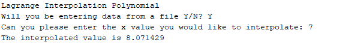
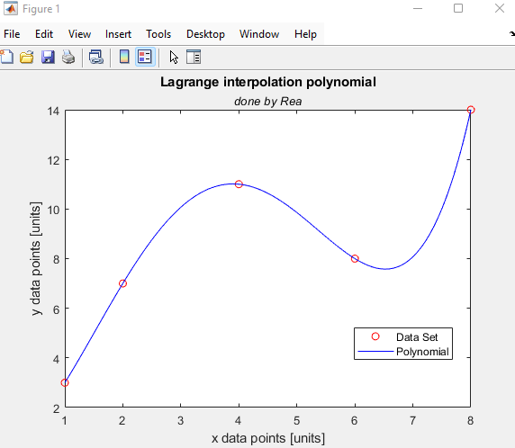

# Lagrange Interpolation 📈

A MATLAB implementation of Lagrange Interpolation, a numerical method used to estimate unknown values between known data points.

## What it does
Given a set of known data points, this program constructs a polynomial that passes through all of them and uses it to estimate values in between.

## Why it matters
In the real world we don't always have complete data. This method lets us fill in the gaps. It is useful in engineering, physics, data science and many other disciplines.

## Built With
- MATLAB

## How to Run
1. Open MATLAB
2. Load `lagrange_interpolation_data.xlsx`
3. Run `Lagrange_interpolation.m`

## Output

